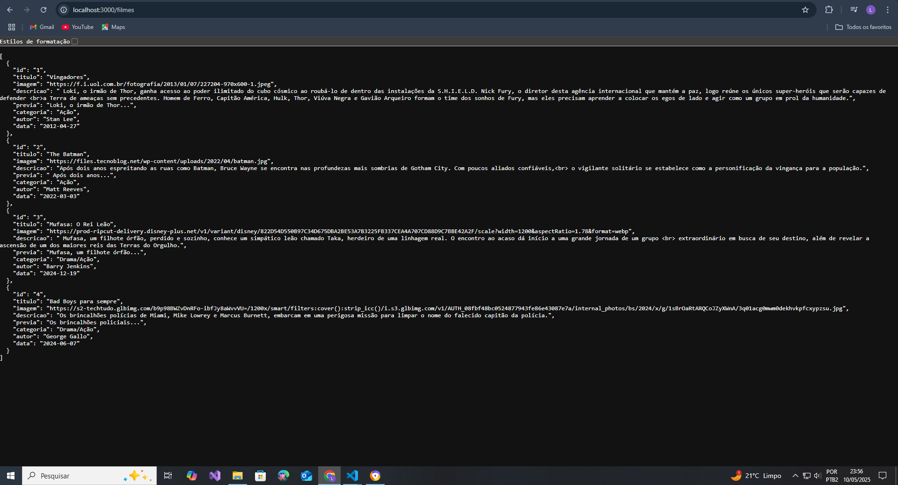

# Trabalho Prático - Semana 11

Nessa etapa, vamos evoluir o projeto anterior e contemplar um ambiente de desenvolvimento mais completo, típico de equipes profissionais. Nesse processo, vamos utilizar um **servidor backend simulado** com o **JSON Server** baseado em APIs RESTful. Um arquivo JSON funcionará como banco de dados e será processado pelo JSON Server que expõe uma API RESTful no servidor.

## Informações do trabalho

- Nome: Lucas Vieira Carvalho
- Matricula: 891261
- Proposta de projeto escolhida: Catálogo de filmes
- Breve descrição sobre seu projeto: 
Um site simples de catálogo de filmes oferece uma lista organizada de títulos, com informações como a sinopse. O usuário pode navegar facilmente pelos filmes e visualizar detalhes de cada título. O layout é clean e intuitivo e agora responsivo, sendo esse um modo para facilitar a experiência do usuário na exploração do catálogo, e agora com uma página de exibição dos detalhes de cada filme que é feita através de uma API via JSONServer que pode ser consumida via fetch nos arquvios js. 

**Print do teste da API com visualização do JSON**

**Print da aba NETWORK com requisições Fetch/XHR**

## **Orientações Gerais**

Nesse projeto você vai encontrar a seguinte estrutura base:

* **Pasta db**
  Essa pasta contem um único arquivo: `db.json`. Esse arquivo serve de banco de dados simulado e nele você deve colocar as estruturas de dados que o seu projeto manipula.
  * **OBS**: Já incluímos a estrutura de usuários como exemplo e para que você possa utlizar no seu projeto. Se precisar, faça os ajustes necessários para seu projeto.
* **Pasta public**
  Nesta pasta você deve colocar todos os arquivos do seu site (front end). Aqui vão os arquivos HTML, CSS, JavaScript, imagens, vídeos e tudo o mais que precisar para a interface do usuário.
* **Arquivo README.md**
  Este arquivo em que são colocadas as informações de quem está desenvolvendo esse projeto e os registros solicitados no enunciado da tarefa.
* **Arquivo .gitignore**
  Configuração do que deve ser ignorado pelo git evitando que seja enviado para o servidor no GitHub.
* **Arquivo package.json**
  Considerado o manifesto do projeto ou arquivo de configuração. Nesle são incluídas as informações básicas sobre o projeto (descrição, versão, palavras-chave, licença, copyright), a lista de pacotes dos quais o projeto depende tanto para desenvolvimento quanto execução, uma lista de  do projeto, scripts entre outras opções.
  * **OBS**: Esse arquivo é criado assim que o projeto é iniciado por meio do comando `npm init`.
  * **OBS2**: Esse arquivo já traz a informação de necessidade do JSONServer.
* **Pasta node_modules**
  Local onde ficam os pacotes dos quais o projeto depende. Evite enviar essa pasta para o repositório remoto. Essa pasta é reconstruída toda vez que se executa o comando `npm install`.

**Ambiente de Desenvolvimento (IMPORTANTE)**

> A partir de agora, **NÃO utilizamos mais o LiveServer/FiveServer** durante o processo de desenvolvimento. O próprio JSONServer faz o papel de servidor.

Para iniciar o JSONServer e acessar os arquivos do seu site, siga os seguintes passos:

1. Abra a pasta do projeto dentro da sua IDE (por exemplo, Visual Studio Code)
2. Abra uma janela de teminal e certifique-se que a pasta do terminal é a pasta do projeto
3. Execute o comando `npm install`
   Isso vai reconstruir a pasta node_modules e instalar todos os pacotes necessários para o nosso ambiente de desenvolvimento (Ex: JSONServer).
4. Execute o comando `npm start`
   Isso vai executar o JSONServer e permitir que você consiga acessar o seu site no navegador.
5. Para testar o projeto:
   1. **Site Front End**: abra um navegador e acesse o seu site pela seguinte URL: 
      [http://localhost:3000]()
   2. **Site Back End**: abra o navegador e acesse as informações da estrutura de usuários por meio da API REST do JSONServer a partir da seguinte URL: 
      [http://localhost:3000/usuarios](http://localhost:3000/usuarios)

Ao criar suas estruturas de dados no arquivo db.json, você poderá obter estes dados através do endereço: http://localhost:3000/SUA_ESTRUTURA, tal qual como foi feito com a estrutura de usuários. **IMPORTANTE**: Ao editar o arquivo db.json, é necessário parar e reiniciar o JSONServer.

**IMPORTANTE:** Assim como informado anteriormente, capriche na etapa pois você vai precisar dessa parte para as próximas semanas. 

**IMPORTANTE:** Você deve trabalhar:

* na pasta **`public`,** para os arquivos de front end, mantendo os arquivos **`index.html`**, **`detalhes.html`**, **`styles.css`** e **`app.js`** com estes nomes, e
* na pasta **`db`**, com o arquivo `db.json`.

Deixe todos os demais arquivos e pastas desse repositório inalterados. **PRESTE MUITA ATENÇÃO NISSO.**
